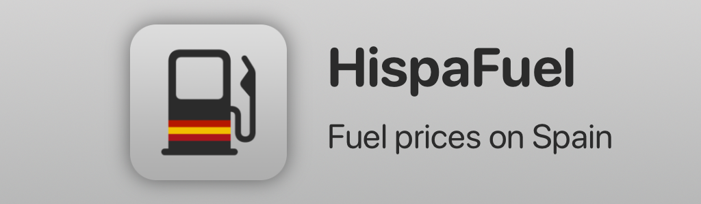

<h1 align="center">
  
</h1>
<h5 align="center">
  This is an iOS application, created with SwiftUI, that displays realtime information about the fuel stations in Spain. It retrieves the data from a public API of the Spanish government, and displays realtime prices, location, opening hours, and more.
</h5>

  

  Data source: <a href="https://datos.gob.es/es/catalogo/e05068001-precio-de-carburantes-en-las-gasolineras-espanolas">Spanish Government API</a>

<h2>Donations</h2>
If you like the project and you want to contribute with the development, you can <a href="https://github.com/sponsors/JGeek00">become a sponsor on GitHub</a>, or you can donate using PayPal.

  

 
 
 
 
 

<b>Created by JGeek00</b>
